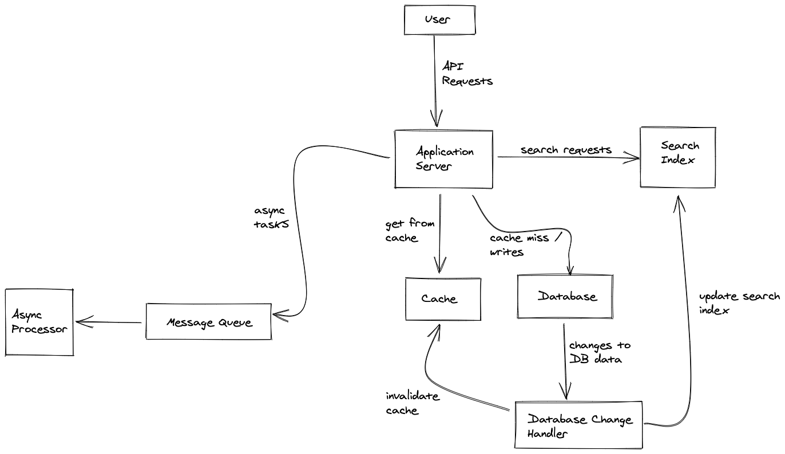

# Reliable, Scalable, and Maintainable Applications

A data-intensive application is built from standard building blocks that provide commonly needed functionality. Some of these standard building blocks are:
* **Databases**: used to store and retrieve information.
* **Caches**: remember the results for expensive operation, and speed up the reads.
* **Search Indexes**: allow users to search the data using keywords / search terms and filter the data in various ways.
* **Stream Processing**: send messages to another process to handle asynchronously.
* **Batch Processing**: periodically crunch a large amount of accumulated data.

Each of the above building blocks can be approached differently, for example - there are different types of databases, different caching strategies, several ways of building search indexes, and choices for stream / batch processing. Determining which building blocks are best suited for the task at hand requires tradeoff, which is what system design is all about.

An example architecture using these building blocks that shows application code is responsible for invalidating the cache and search indexes, and how async tasks go to a message queue for processing.

## Reliability

* Reliability is the ability of system to work correctly (i.e. providing the correct functional result at a desired level of performance) even in the face of faults (hardware, software, or human errors).
* To achieve a high degree of reliability the system should be fault-tolerant and fault-resilient.
* Fault vs Failure
  * Fault is system deviating from what its specs.
  * Failure is the system stopping to provide the service to the user.
* It is impossible to have a system with zero faults so it's best to develop a fault tolerant system that can *prevent faults from causing failures*.
* Often faults are introduced intentionally (killing processes without warning, or terminating instances) to detect if introduction of faults does not cause the whole system failure. An example of such system is Chaos Monkey (used by Netflix).

**Hardware Faults**

* Some examples of **hardware faults** are hard disk crashes, power grid blackout, data center wrong cable unplugged. Given time, disk failures are inevitable.
* Hard drives have a mean time to failure (MTTF) of about 10 to 50 years.
* Redundancy (back up hosts, backup power, hot-swappable CPUs) is a good alternative to reduce the rate of system failure due to hardware failures.
* There's a move towards systems that can tolerate loss of entire machines by using software fault tolent techniques in preference or in addition to hardware redundancy. The system can be available while deployments happen on the hosts, or if one or more hosts are down to patch security upgrades.

**Software Errors** 
* Systematic errors are harder to anticipate and could cause many more system failures than a hardware failure.
* For example a bug that makes a machine crash on a specific input, dependency returning a corrupted response, cascading failures - where one machine's failure causes another machine's failure (an example is failure of cache causing tremendous traffic to go to the datastore causing a datastore failure).
* Carefully thinking about assumptions, interactions in the system, continuous testing, allowing processes to crash and restart, monitoring/alerting and measuring system in production are some ways through which software errors can be prevented.

**Human Errors**
* 